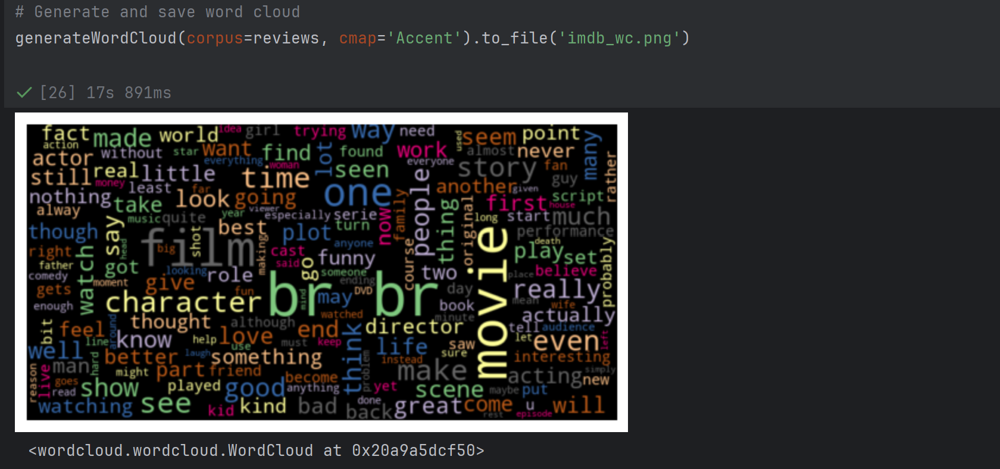

# Text Classification
This repository contains a Jupyter Notebook for text classification using machine learning techniques.

## Features
- Data preprocessing and text vectorization
- Training models using various algorithms
- Performance evaluation and metrics analysis

## Installation
1. Clone the repository:
   ```sh
   git clone https://github.com/Jayaprakashsuseelam/TextClassification.git


## 📌 Screenshots



